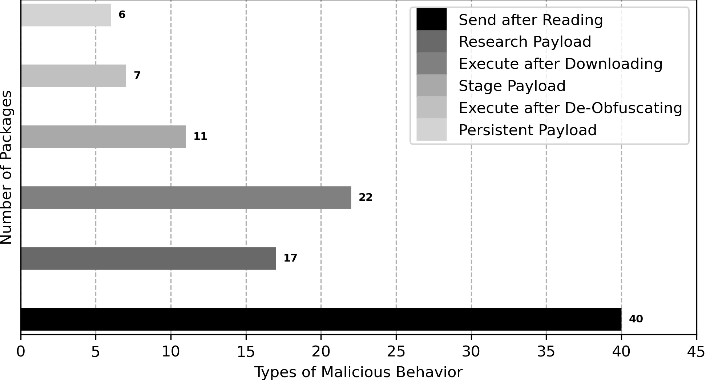

# Malicious Packages
The packages here all have behavioral maliciousness while purposeful maliciousness is not necessary.
## Malicious Type
1: Execute after Downloading.   
2: Send after Reading.   
3: Execute after De-Obfuscaiting.   
4: Stage Payload.   
5: Persistent Payload.   
6: Research Payload.   
## Distribution
