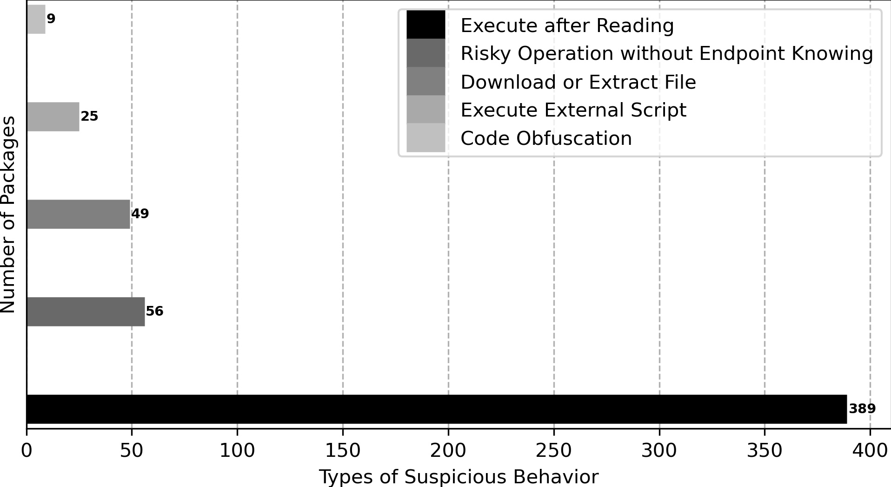

# Malicious Packages
The packages here all have behavioral maliciousness while purposeful maliciousness is not necessary.
## Malicious Type
1: Execute External Script.   
2: Code Obfuscation.   
3: Download or Extract File.   
4: Excute after Reading.  
5: Risky Operation without Endpoint Knowing. 
## Distribution
